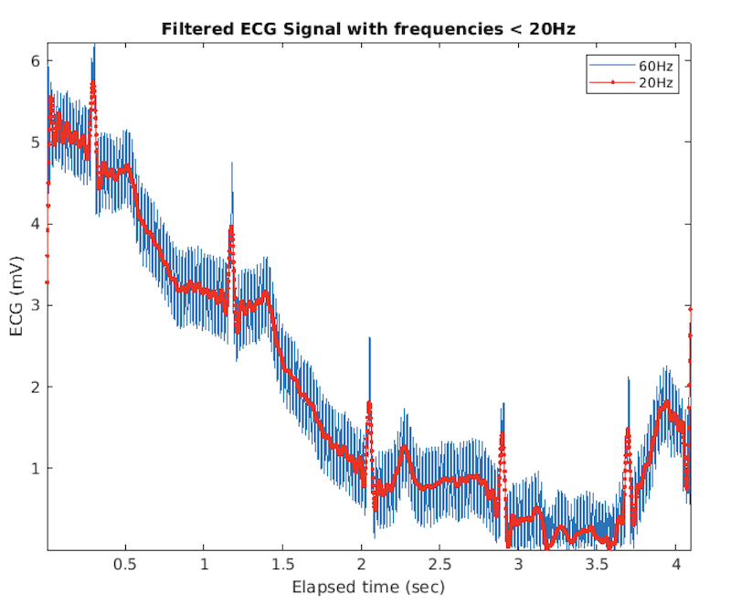

# Signal-Processing-Applied-Mathematics
BME 671 Course Assignment

#### Filtered Signal after removing noise

#### Final Signal after removing noise and baseline

#### Designed a filter for removing noise from ECG Signal

